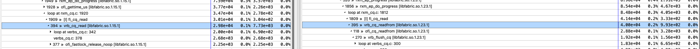
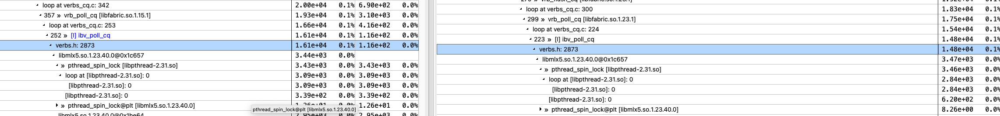

# MPI_Alltoall benchmarks 

This folder contains results from the software upgrade.

## Compiling

```bash
CC -O2 main.cpp -o test
```


## Results

The time for initializing the first `MPI_Alltoall` is reported separatly, and is indicated as the initialization. Following calls are averaged over 10 iterations and both the mean and standard deviation are reported. We have tested both ucx and ofi. Osu benchmarks show a decrease in performance between the two images at message size 512, which is the same as the cutoff size for the change between the short and long message alghorithm. The slowdown on v0.4 is down to about `10%` of the production run time, once initialization is discarded, for both OFI and UCX. We tried to run on a local reservation of 128 nodes and re-tested to see if locality was affecting network latency, but results for the production image are compatible for a job submitted to the whole reservation and a job submitted to the local reservation.
We have also chacked that the results of `MPICH_ENV_DISPLAY= 1` are the same on both production and updated nodes.

### Performance

Metric | Image | Network middlewere | Notes
--- | --- | --- | -- 
v0.4 | 0.90(3) | Average per iteration after the first step | OFI
v0.3 | 1.20(8) | Average per iteration after the first step | OFI
Prod | 0.82(2) | Average per iteration after the first step | OFI
v0.4 | 1664.03 | Time for first iteration ( essentially mpi initialisation ) | OFI
v0.3 | 1518.39 | Time for first iteration ( essentially mpi initialisation ) | OFI
Prod | 2077.91 | Time for first iteration ( essentially mpi initialisation ) | OFI
v0.4.1 | 0.94(2) | Average per iteration after the first step , local reservation| OFI
v0.4.1 | 1666.8 | Time for first iteration ( essentially mpi initialisation ), local reservation | OFI
v0.4.1 | 1.16(2) | Average per iteration after the first step, local reservation | UCX
Prod | 0.81(1) | Average per iteration after the first step , local reservation| OFI
Prod | 1.04(3) | Average per iteration after the first step , local reservation| UCX

### Profiling with hpctoolkit

When benchmaring in v0.4 with OFI I got a profile and compared with the production system.

The difference appears to be in the rxm provider that calls verbs differently



This is likely because the versions of libfabric are different. However for both libraries, most of the time difference is inside polling verbs, in particualar the time spent in the mellanox libraries.




